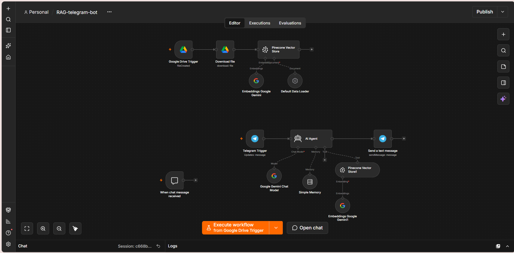
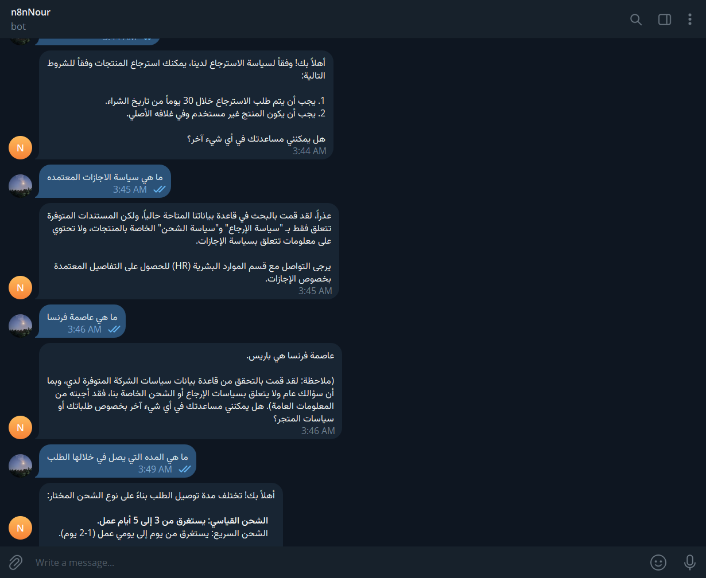

# AI Customer Support Bot using RAG & n8n

An automated customer support assistant built with **n8n**, utilizing **RAG (Retrieval-Augmented Generation)** to answer policy-related queries accurately without hallucinations.

---

## 🛠️ Tech Stack & Architecture
- **Automation Platform:** [n8n](https://n8n.io/)
- **Large Language Model (LLM):** Google Gemini Chat Model
- **Embedding Model:** Google Gemini Embeddings
- **Vector Database:** Pinecone
- **Interface:** Telegram Bot API
- **Data Source:** Google Drive (Store Policy Documents: Shipping & Returns)

---

## 📸 Workflow Architecture
The system consists of two core pipelines:
1. **Data Ingestion Pipeline:** Syncs PDF policies from Google Drive, generates vector embeddings via Gemini, and indexes them into Pinecone.
2. **Retrieval & Chat Pipeline:** Listens to Telegram messages, retrieves relevant context from Pinecone, maintains chat memory per user session, and returns precise answers.

---

## 🧪 Testing & Evaluation (In-Scope vs. Out-of-Scope)

The agent was evaluated with both Arabic and English queries to verify retrieval accuracy and multilingual capabilities across different scenarios.

### Arabic Interaction (Localized Support)

### English Interaction (Multilingual Support)

### Evaluation Summary:
- **In-Scope Queries:**
  - **Return Conditions:** Successfully retrieved exact conditions (30-day window, original packaging).
  - **Shipping Timelines:** Accurately provided delivery estimations based on shipping tiers.
- **Out-of-Scope Queries:**
  - **HR / Vacation Policy:** The agent checked Pinecone, verified that documents only cover shipping/returns, and directed the user to HR without fabricating answers.
  - **General Knowledge:** Answered general questions while explicitly noting that the query falls outside the store policy domain.
---

## 🚀 How to Run
1. Import the `RAG-telegram-bot.json` file into your n8n workspace.
2. Add your credentials for:
   - Google Drive
   - Google Gemini API
   - Pinecone (API Key & Index)
   - Telegram Bot Token
3. Update the Pinecone index name to match your setup.
4. Activate the workflow and test via Telegram!
